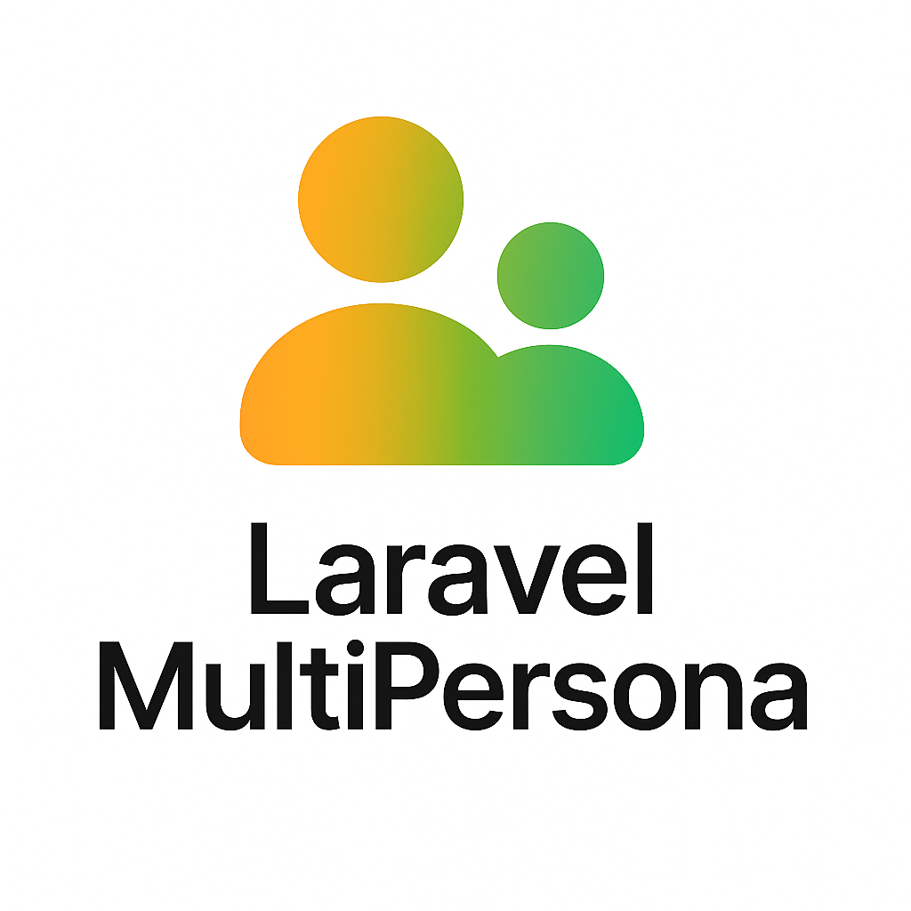

# Laravel MultiPersona



**Laravel MultiPersona** is a lightweight context-layer system for Laravel users.  

[](https://packagist.org/packages/grazulex/laravel-multipersona)
[](https://packagist.org/packages/grazulex/laravel-multipersona)
[](https://github.com/Grazulex/laravel-multipersona/blob/main/LICENSE.md)
[](https://php.net/)
[](https://laravel.com/)
[](https://github.com/Grazulex/laravel-multipersona/actions)
[](https://github.com/laravel/pint)

---

**Laravel MultiPersona** is a lightweight context-layer system for Laravel users.  
It allows a single user to switch between different **roles**, **accounts**, or **tenants** dynamically, without creating multiple logins or sessions.
---

## 🔍 What It Solves

- Switch between "personas" (admin ↔ client, company A ↔ company B)
- Contextual permissions and role handling
- No UI or API enforced – 100% backend, policy, and middleware-driven

## 📦 Installation

```bash
composer require grazulex/laravel-multipersona
```

## 🧩 Core Concepts

- **Persona**: A context attached to a user (e.g. company, role, project)
- **Active Persona**: The currently selected context
- **Persona Manager**: A service to query, switch, or manipulate personas
- **Middleware**: Force or apply a persona context

## ✅ Example

```php
persona()->id; // Get the current active persona ID
auth()->user()->personas; // List all personas for the user
```

## 🧱 Provided

- Trait: `HasPersonas` for your `User` model
- Middleware: `EnsureActivePersona`, `SetPersonaFromRequest`
- Helpers: `persona()`, `personas($user)`
- Bindable Contract: `PersonaInterface`
- Service: `PersonaManager`

## ❌ Not Included

- No routes or controllers
- No CLI or HTTP APIs
- No UI layer – you choose how to expose it

## 📄 See `/docs` and `/examples` for more info.
---

## 🤝 Contributing

We welcome contributions! See our [Contributing Guide](CONTRIBUTING.md).

---

<div align="center">
  <p>Made with ❤️ for the Laravel community</p>
  <p>
    <a href="https://github.com/grazulex/laravel-multipersona/wiki">📖 Documentation</a> •
    <a href="https://github.com/grazulex/laravel-multipersona/issues">🐛 Report Issues</a> •
    <a href="https://github.com/grazulex/laravel-multipersona/discussions">💬 Discussions</a>
  </p>
</div>