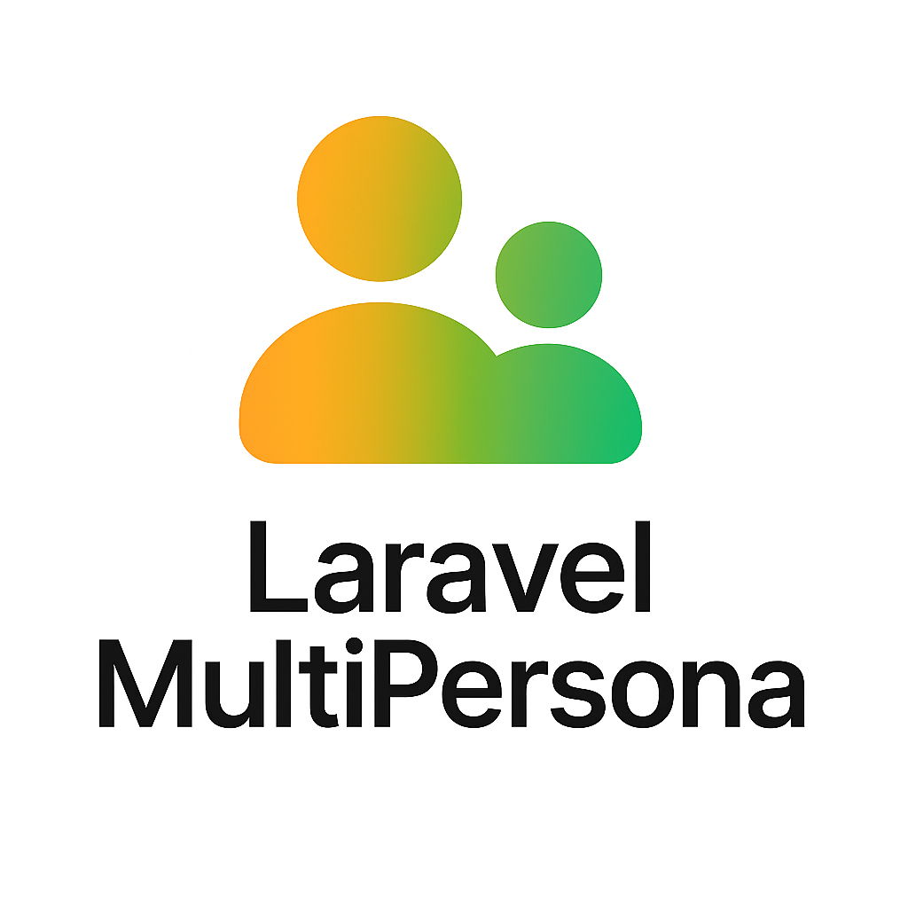

# Laravel MultiPersona



> [!TIP]
> **What Laravel MultiPersona does for you** — Let one user act as several personas — admin and client, company A and company B — and switch between them without extra logins or sessions. Backend-only, it works with your existing policies and middleware.
>
> **This package is free and maintained on my own time.** If it saves you hours, a small contribution helps me keep it going:
> [💖 GitHub Sponsors](https://github.com/sponsors/Grazulex) · [☕ Buy Me a Coffee](https://buymeacoffee.com/grazulex) · [PayPal](https://paypal.me/strauven)

**Laravel MultiPersona** is a lightweight context-layer system for Laravel users.  

[](https://packagist.org/packages/grazulex/laravel-multipersona)
[](https://packagist.org/packages/grazulex/laravel-multipersona)
[](https://github.com/Grazulex/laravel-multipersona/blob/main/LICENSE.md)
[](https://php.net/)
[](https://laravel.com/)
[](https://github.com/Grazulex/laravel-multipersona/actions)
[](https://github.com/laravel/pint)

---

**Laravel MultiPersona** is a lightweight context-layer system for Laravel users.  
It allows a single user to switch between different **roles**, **accounts**, or **tenants** dynamically, without creating multiple logins or sessions.

---

## 🔍 What It Solves

- Switch between "personas" (admin ↔ client, company A ↔ company B)
- Contextual permissions and role handling
- No UI or API enforced – 100% backend, policy, and middleware-driven

## 📦 Installation

### Requirements

- PHP 8.3 or higher
- Laravel 12.x or 13.x

```bash
composer require grazulex/laravel-multipersona
```

## 🧩 Core Concepts

- **Persona**: A context attached to a user (e.g. company, role, project)
- **Active Persona**: The currently selected context
- **Persona Manager**: A service to query, switch, or manipulate personas
- **Middleware**: Force or apply a persona context

## ✅ Quick Example

```php
// Get current active persona
$currentPersona = persona();

// List all user personas
$userPersonas = auth()->user()->personas;

// Create a new persona
$persona = auth()->user()->createPersona([
    'name' => 'Company Admin',
    'context' => [
        'role' => 'admin',
        'company_id' => 123,
        'permissions' => ['read', 'write', 'delete']
    ]
]);

// Switch to persona
auth()->user()->switchToPersona($persona);
```

## 🧱 What's Provided

- **Trait**: `HasPersonas` for your `User` model
- **Middleware**: `EnsureActivePersona`, `SetPersonaFromRequest`
- **Helpers**: `persona()`, `personas($user)`
- **Events**: Complete event system for persona lifecycle
- **Service**: `PersonaManager` for programmatic access
- **Contract**: `PersonaInterface` for custom implementations

## ❌ What's Not Included

- No routes or controllers
- No CLI or HTTP APIs  
- No UI layer – you choose how to expose it

## 📚 Complete Documentation

### Getting Started
- [📖 Installation Guide](docs/installation-guide.md) - Complete setup instructions
- [� Usage Guide](docs/usage-guide.md) - Basic and advanced usage examples
- [⚡ Quick Start Example](examples/basic_usage.php) - Working code examples

### Core Features  
- [🎭 Events Guide](docs/events-guide.md) - Event system and listeners
- [🛡️ Middleware Guide](docs/middleware-guide.md) - Route protection and context
- [🏗️ Architecture](docs/architecture.md) - System design and components

### Advanced Topics
- [🎯 Advanced Patterns](docs/advanced-patterns.md) - Multi-tenant, role hierarchy, delegation
- [🌐 Frontend Integration](docs/frontend-integration.md) - Vue.js, React, Alpine.js examples
- [📋 API Reference](docs/api-reference.md) - Complete method documentation

### Use Cases
- **Multi-tenant SaaS**: Users switch between different company contexts
- **Role-based Access**: Same user, different permissions per context
- **Agency Management**: Manage multiple client accounts
- **Marketplace Platforms**: Buyer/seller context switching
- **Enterprise Systems**: Department or project-based access

## 🎯 Real-World Examples

### Multi-tenant Application
```php
// User switches between companies
$companyA = $user->createPersona([
    'name' => 'Acme Corp Admin',
    'context' => [
        'company_id' => 1,
        'role' => 'admin',
        'permissions' => ['manage_users', 'view_reports']
    ]
]);

$companyB = $user->createPersona([
    'name' => 'TechStart User', 
    'context' => [
        'company_id' => 2,
        'role' => 'user',
        'permissions' => ['view_dashboard']
    ]
]);
```

### Middleware Protection
```php
// Protect routes requiring specific roles
Route::middleware(['auth', 'persona.required', 'role:admin'])->group(function () {
    Route::get('/admin/dashboard', [AdminController::class, 'dashboard']);
});
```

### Frontend Integration
```vue
<!-- Vue.js component -->
<PersonaSelector 
    :current-persona="currentPersona"
    :available-personas="availablePersonas"
    @persona-changed="handlePersonaChange"
/>
```

## 🧪 Testing

The package includes comprehensive test coverage:

```bash
composer test
```

Current test metrics:
- **58 tests** across Unit, Feature, Integration, and Listeners
- **87% code coverage**
- **149 assertions** ensuring reliability

## 🤝 Contributing

We welcome contributions! See our [Contributing Guide](CONTRIBUTING.md) for details.

### Development Setup
```bash
git clone https://github.com/grazulex/laravel-multipersona.git
cd laravel-multipersona
composer install
composer test
```

## 🔒 Security

If you discover any security vulnerabilities, please review our [Security Policy](SECURITY.md).

## 💖 Support This Package

Laravel MultiPersona is free, open source and maintained on my own time. If it saves you hours, here is how you can give back:

- ⭐ **Star the repository** — it helps other developers find it
- 🐦 **Share it** with your team and network
- 💖 **[Sponsor on GitHub](https://github.com/sponsors/Grazulex)**, **[buy me a coffee](https://buymeacoffee.com/grazulex)** or **[donate via PayPal](https://paypal.me/strauven)** — every contribution funds maintenance, new features and Laravel upgrades

## 📄 License

Laravel MultiPersona is open-sourced software licensed under the [MIT license](LICENSE.md).

---

<div align="center">
  <p>Made with ❤️ for the Laravel community</p>
  <p>
    <a href="https://github.com/grazulex/laravel-multipersona/wiki">📖 Documentation</a> •
    <a href="https://github.com/grazulex/laravel-multipersona/issues">🐛 Report Issues</a> •
    <a href="https://github.com/grazulex/laravel-multipersona/discussions">💬 Discussions</a>
  </p>
</div>